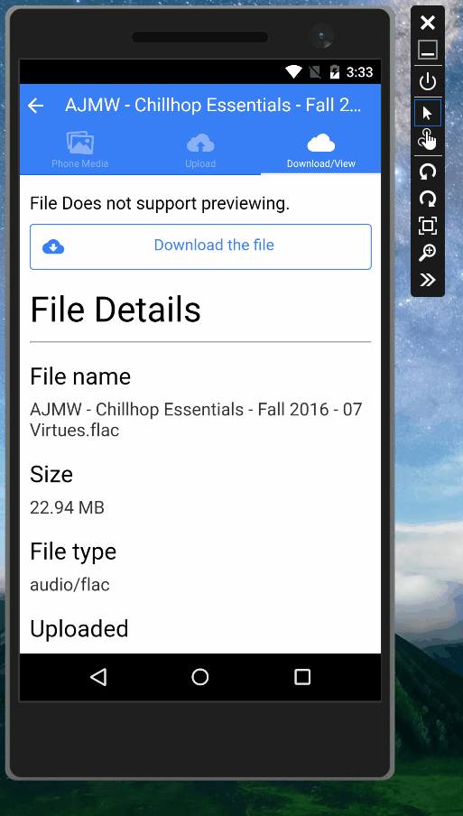

# cordova-plugin-downloadmanager
A Cordova plugin to download file in system's default download manager

## Supported Platforms

 - Android (SDK >= 11)

 ## Installation

 ```
 cordova plugin add https://github.com/vasani-arpit/cordova-plugin-downloadmanager
 ```

 ## How to Use 

 ```
 //after device is ready
var fail = function (message) {    
    alert(message)
}
var success = function (data) {
        console.log("succes");
}
cordova.plugins.DownloadManager.download("Your URL to download", success, fail);
 ```

## Result



_**If this plugin helps your project then don't forget to ⭐ star the repo.**_

## Contributing

1. Fork it
2. Create your feature branch (`git checkout -b my-new-feature`)
3. Commit your changes (`git commit -am 'Add some feature'`)
4. Push to the branch (`git push origin my-new-feature`)
5. Create new Pull Request
